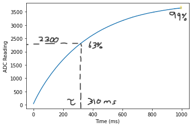

# ME405-Lab4
## RC Circuit Plot

> In this experiment we connected a resistor and capacitor to our breadboard
> establishing an RC circuit with our microcontroller. The ADC pin can read out
> continuous values from this circuit, from which this data can be saved and
> plotted. 
> 
> We plotted the ADC read out versus time for one second and achieved the 
> response above. Experimentally our time constant is about 310 milliseconds. 
> Using the manufacturer's values and the resistor color table, our circuit
> has a resistance of 1000 kohms and a capacitance of 335 nF. Multiplying 
> these two values together gives us a time constant of 0.335 seconds, 7.5% 
> off the expected value based on the RC values. This difference falls in 
> the typical tolerance range for electronic components. 
